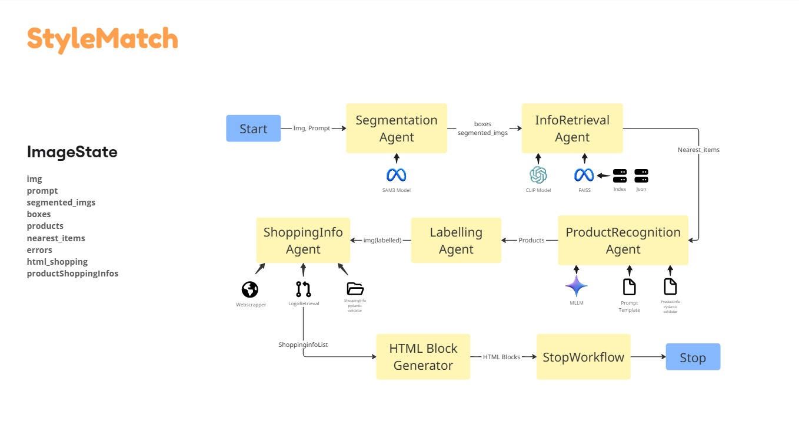

# StyleMatch

StyleMatch is a multimodal fashion discovery app that takes an input image, detects fashion items, identifies each item, and returns a shoppable product gallery with links, prices, seller branding, and ratings.

The project combines image segmentation, embedding-based retrieval, LLM-based product understanding, and shopping search APIs behind a Gradio UI.

---

## Features

- **Image upload + text prompt** for target fashion category/item.
- **Automatic object segmentation** of products in the image.
- **Vector retrieval (FAISS + CLIP embeddings)** to fetch similar catalog context.
- **LLM-driven product recognition** to infer structured product attributes.
- **Shopping data enrichment** (price, rating, URL, seller, logo).
- **Styled HTML product cards** rendered directly in Gradio.
- **Annotated output image** with labeled product boxes.

---

## Project structure

```text
StyleMatch/
├── app/
│   ├── main.py                         # App launcher
│   ├── gradioUi.py                     # Gradio UI layout and callbacks
│   └── Workflows/
│       └── ImgProcessingWorkflow.py    # End-to-end LangGraph workflow
├── utils/
│   ├── Agents/                         # Workflow nodes
│   ├── models/                         # Model clients/loaders (Gemini, CLIP, SAM3)
│   ├── tools/                          # Shopping API + seller logo utility
│   └── Templates/                      # Pydantic schemas + prompt builders
├── data/
│   ├── fashion_product_images.index    # FAISS vector index
│   └── fashion_product_info.json       # Catalog metadata for retrieval
└── README.md
```

---

## Workflow diagram





---

## Workflow overview

`ImgProcessing` builds and executes a LangGraph pipeline:

1. **Segmentation** (`SegmentationAgent`) → detects and crops objects using SAM3.
2. **Info retrieval** (`InfoRetrievalAgent`) → embeds crops with CLIP and queries FAISS index.
3. **Product recognition** (`ProductRecognizerAgent`) → uses Gemini to return structured `ProductInfo`.
4. **Image labeling** (`imageLabelingAgent`) → draws boxes + product names on the original image.
5. **Shopping info** (`shoppingInfoAgent`) → queries product-search API and attaches seller logos.
6. **HTML generation** (`htmlblockGeneratorNode`) → creates styled product cards for UI display.
7. **Stop node** (`StopWorkflowAgent`) → appends terminal status.

---

## Requirements

- **Python** 3.11+ (3.12 recommended).
- Internet access for external APIs/model endpoints.
- Optional GPU for faster inference.

A project-level `requirements.txt` is included for reproducible setup.

### Install from requirements.txt

```bash
pip install -r requirements.txt
```

This `requirements.txt` was derived from `testModal.py` plus project runtime imports, so it includes both local app dependencies and Modal/test utilities.

> If you have CUDA, install the CUDA-compatible PyTorch/FAISS variants for best performance.


### Modal test workflow (from `testModal.py`)

If you want to run the same cloud workflow harness:

```bash
modal run testModal.py
```

What `testModal.py` does:
- Builds a Debian Python 3.10 image.
- Clones and installs `sam3` from source.
- Installs the required Python libraries.
- Mounts the repository and `data/` into the Modal container.
- Runs `ImgProcessing` on `data/demo.jpg` with prompt `"Shoes"` on a T4 GPU.

---

## Environment variables

Create a `.env` file in the repository root:

```bash
# Google / Gemini
GOOGLE_API_KEY2=your_google_api_key

# Hugging Face (required by SAM3 loader login)
HUGGINGFACEHUB_API_TOKEN=your_hf_token

# RapidAPI product search
X_API_KEY=your_rapidapi_key

# logo.dev seller logos
LOGO_DEV_PUBLISHABLE_KEY=your_logo_dev_key
```

### Notes

- `geminiModel.py` initializes two clients; make sure your Google key is valid.
- `samLoader.py` accesses `HUGGINGFACEHUB_API_TOKEN` at import-time.
- Shopping results depend on RapidAPI quota/availability.

---

## Data setup

Ensure these files exist:

- `data/fashion_product_images.index`
- `data/fashion_product_info.json`

They are required for the retrieval node (`InfoRetrievalAgent`).

> Important: `ImgProcessingWorkflow.py` currently references an **absolute** index/json path:
>
> - `/teamspace/studios/this_studio/StyleMatch/data/fashion_product_images.index`
> - `/teamspace/studios/this_studio/StyleMatch/data/fashion_product_info.json`
>
> If your local path differs, update these paths in `app/Workflows/ImgProcessingWorkflow.py` to point to your local `data/` directory.

---

## Running the app

From repo root:

```bash
python app/main.py
```

This starts the Gradio app (`share=True`, `debug=True` in current code).

You can also run directly:

```bash
python app/gradioUi.py
```

---

## How to use

1. Upload an image containing one or more fashion items.
2. Optionally provide a prompt (for example: `red dress`, `men's sneakers`, `denim jacket`).
3. Click **Submit**.
4. Review:
   - **Annotated image** with bounding boxes + labels.
   - **Recommended product cards** with links, ratings, prices, and seller info.

---

## Troubleshooting

- **`No objects detected in the image`**
  - Try a clearer image, a broader prompt (`Fashion`), or better lighting/contrast.

- **SAM/Gemini import or initialization errors**
  - Verify `.env` keys and package installation.
  - Confirm network connectivity.

- **Font error in image labeling (`DejaVuSans-Bold.ttf`)**
  - Install the font on your system or adjust `ImageFont.truetype(...)` in `imageLabelingAgent.py`.

- **FAISS file/path errors**
  - Confirm index + metadata files exist and update absolute paths in workflow file.

- **Empty shopping cards or missing logos**
  - Check `X_API_KEY` and `LOGO_DEV_PUBLISHABLE_KEY`.
  - API limits/region availability can affect output.

---

## Development notes

- The workflow graph is compiled per request in `ImgProcessing`; if you optimize for throughput, consider reusing initialized agents/graph.
- Product info schemas live in `utils/Templates/schemas.py`.
- HTML styling for product cards is centralized in `htmlblockGeneratorNode`.

---

## License

This project is distributed under the terms in the `LICENSE` file.
